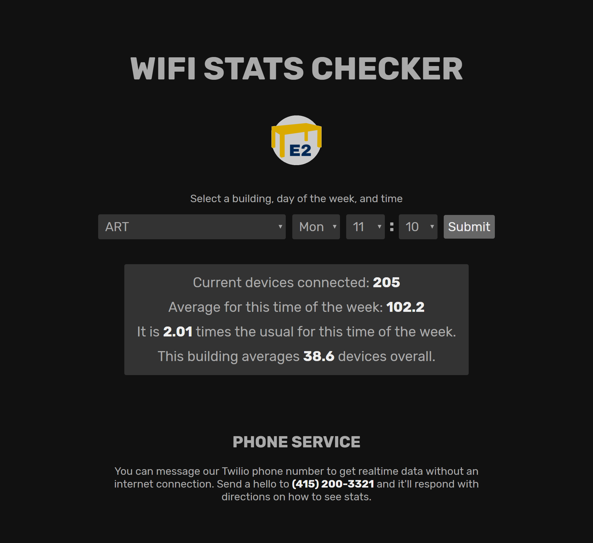

# Wifi Stats Checker

**[table-e2.github.io](https://table-e2.github.io/)**

This project was created by [us](https://github.com/table-e2/table-e2.github.io/graphs/contributors) for [HackDavis](https://hackdavis.io/) 2019 in under 24 hours. You can see other submissions [here](https://hackdavis2019.devpost.com/submissions).

Using this site, you can check current wifi usage at buildings across UC Davis and compare it to historical data. At the moment, the historical data covers the last 7 months. Each building has data for each 10-minute interval of the week, which should accurately reflect average usage for most cases.

You can also request data such as most popular buildings and historical summaries using the text message bot at **(415) 200-3321.**



## Applications

Wifi Stats Checker is great for informing anyone curious about UC Davis wifi statistics, but can also be used to check overall popularity and how busy buildings are normally compared to now. Students can use the relationship between current and historical data to find quiet places to study.

With more development, the page could show more detailed stats, such as graphs of any time period or comparisons between different buildings.

We could also monitor information like what is shown on the site and send alerts to the relevant technicians when there are anomalies, which could signal either technical (e.g. power outage, broken cable) or demographic (e.g. identify places of crowding) problems.

Combined with surveys of other statistics, like building occupancy or weather, we could create approximations of other statistics that are harder or more expensive to measure in real time. For example, we could check how the number of wifi connections on a rainy day correlates to occupancy of the MU, and use wifi connection numbers to approximate how many seats are available on other rainy days.

## Technical details

The current WiFi data comes from OSIsoft's PI System API. This gives the number of connected devices each ten minutes.

The historical WiFi data also comes from OSIsoft, who uploaded usage from June 2018 to February 2019 on Google Cloud Platform. This data was processed into [data.json](data.json) to be easily consumed by the webpage.

The webpage was built with plain HTML, CSS, and JavaScript. It fetches current data directly from the PI System API and historical data from [data.json](data.json).

The phone service uses Twilio's automated texting service through Python that runs on a VM in Google Cloud Platform. It also fetches current data from the PI API and uses premade historical data reports.

All alternative representations of the data (such as [data.json](data.json) and [AllBuildings.txt](twilio/AllBuildings.txt)) were made using custom Python scripts which ran on Google Cloud Platform and accessed OSIsoft's historical data bucket.

## Phone service examples

Help text sent whenever a message doesn't match a command:

```text
June 2018 - Feb 2019 Totals

Commands:
(# is any number between 1 and 50)
Newhigh# - Highest Past 10 Minutes
Newlow# - Lowest Past 10 Minutes

Below are cumulative annual figs:
High# - Highest of Year
Low# - Lowest of Year

Campuswide Figures:
10minute - Ten Minute Intervals
Hourly - 1 Hour Intervals
Weekday - By Day of the Week
```

`Newhigh10` (the ten most popular buildings on campus with device count):

```text
1. LIB 1447
2. MU 466
3. SCI-LEC 411
4. ARC 359
5. CFA-MONDAVI 252
6. CHEM 185
7. BAINER 175
8. KEMPER 139
9. SOCSCI 119
10. OLSON 113
```

`Hourly` (total number of connections recorded per hour in the historical data):

```text
00:00 : 3,833,945
01:00 : 3,601,695
02:00 : 3,420,862
03:00 : 3,354,680
04:00 : 3,340,979
05:00 : 3,392,648
06:00 : 3,604,201
07:00 : 4,580,232
08:00 : 8,534,878
09:00 : 14,072,334
10:00 : 18,093,354
11:00 : 20,096,478
12:00 : 20,157,384
13:00 : 20,819,814
14:00 : 21,281,500
15:00 : 20,715,445
16:00 : 18,760,073
17:00 : 15,218,827
18:00 : 11,306,692
19:00 : 8,936,306
20:00 : 7,114,197
21:00 : 5,851,801
22:00 : 4,904,293
23:00 : 4,278,256
```

## Notes

The current device counts will likely stop being available as API access was granted specifically for HackDavis 2019. If the API is unavailable, they will show as zero.

If you are viewing this over one week later, the phone service may also be inactive.

(ノ°Д°)ノ︵ ┻━┻ *Table E2*
